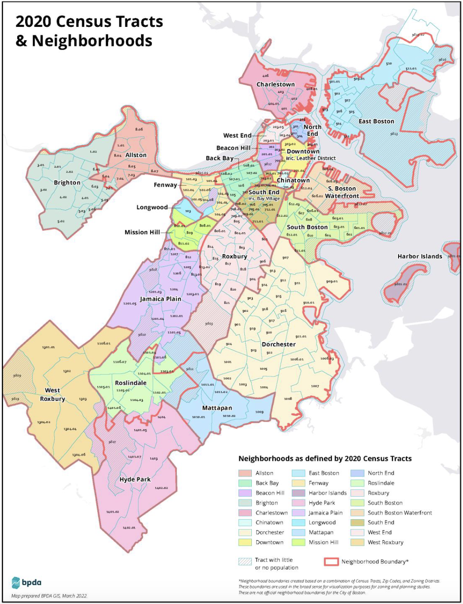

Source: [Boston Planning and Development Agency](https://www.bostonplans.org/getattachment/e8629081-b656-4c43-b38a-b0cb5e7e3b4b)


### 1. Introduction

*Does accessibility to jobs by transit improve transit usage in Massachusetts?* How much of a population's transit usage (as a means of transportation to work) can be explained by job access? In this study, I plan to examine to what extent access to jobs via transit increases transit commuting rates in the Commonwealth of Massachusetts. 

In urban environments, people access jobs, education, recreational facilities, and other services via many different modes of transportation. Because of its ability to move large amounts of people, transit is seen as an effective way to get around a city. However, the United States suffers from relatively poor transit performance in metropolitan areas. 

Massachusetts has several major transit agencies, such as the Massachusetts Bay Transportation Authority (MBTA), MetroWest Regional Transit Authority, Lowell Regional Transit Authority, and others. Through the Massachusetts Bay Transportation Authority (MBTA), Boston commuters have several public transportation options: bus service, heavy rail, light rail, and commuter rail.

I hypothesize that high accessibility to jobs by transit increases the use of transit as a means of transportation to work.

This question and hypothesis are important for determining how job accessibility influences transit usage. If a relationship exists, this research will be useful for learning the extent people use transit for commuting.


### 2. Data

For this observational, cross-sectional research, I will analyze data from the following:

Owen, Andrew, et al. [Access Across America: Transit 2021 Data](https://doi.org/10.13020/cxkh-at83). University of Minnesota Center for Transportation Studies, Accessibility Observatory (2023).

U.S. Census Bureau, [American Community Survey: Table B08301](https://data.census.gov/table/ACSDT5Y2021.B08301?t=Commuting&g=040XX00US25$1400000&y=2021). ACS 5-Year Estimates Data Profiles (2021).

Owen et al. examined the accessibility to jobs by transit across the United States. Their study is the most detailed evaluation to date of access to jobs by transit, and it allows for a direct comparison of the transit accessibility performance of America's metropolitan areas. These data are part of a longitudinal study. Transit data for additional years can be found in the Accessibility Observatory Data collection: http://hdl.handle.net/11299/200592

The U.S. Census Bureau conducts an annual demographics survey, called the American Community Survey, in the form of estimates, in a variety of tables, tools, and analytical reports.

For Owen et al., We will use the data from this paper, contained in the `data/Massachusetts_25_transit_census_tract_2021.csv` files, to explore transit accessibility. A description of the variables is listed below:

| Name              | Description                                                                                                |
|-------------------|------------------------------------------------------------------------------------------------------------|
| `mode`            | The type of travel modes, one of auto; bike; or transit                                                    |
| `year`            | NAE data year, the year for which this dataset is relevant                                                 |
| `parent_area`     | The ID of the containing geography within which the data averages are calculated                           |
| `summary_level`   | Level of geography at which averages are calculated; state, county, census tract, block group, or block    |
| `geoid`           | The ID of the particular census geography for which the data averages are calculated                       |
| `threshold`       | The travel time threshold in seconds, ranging from 300 to 3600 seconds                                     |
| `weighted_average`| Average number of jobs a person can reach from a given census area within the travel time threshold for a specific                       mode                                                                                                       |

For ACS data, we will use the `data/ACSDP5Y2021_B08301_Data.csv` files to get more information about demographics and transit usage rates by census tract. The **B08301** Table is "MEANS OF TRANSPORTATION TO WORK".

*Note the `geoid` variable refers to the FIPS code, a 15-digit number that begins with the state identifier and ends with the block identifier. It consists of the 2-character state FIPS code, the 3-character county FIPS code, the 6-character census tract code, and the 4-character tabulation block code.*


I define job accessibility as the average number of jobs a person can reach from a specific census tract within a given time threshold. For this study, I will assume that components such as traveling to the nearest transit station or waiting at the station are included in the calculation of transit travel times. Owen et al. (2023) goes into more detail about the methodology. 

How long it takes someone to travel a certain distance from their home -- 60 km in this dataset -- heavily influences their physical, social, and economic mobility. Short commute times allow workers to reach more opportunities because they can go further distances more efficiently. 

In this vein, successful transit systems improve job accessibility for people, since faster service would mean greater "reach" via transit. I expect that in Massachusetts, high job accessibility by transit would increase rates of transit commuting.

My explanatory variable is "job accessibility by transit" a  cumulative opportunities accessibility measure which counts the number of opportunities (in this case, jobs) reachable from each origin within a census tract within a given travel time threshold (up to 60 minutes or 3600 seconds). For example, a census tract *X* in Boston may have 500 jobs reachable by transit within 60 minutes.

The outcome variable is the rate of transit usage as a means of transportation to work. Based on 2021 American Community Survey data, we will measure what percentage of people in a census tract get to work by public transportation. For example, let's say about 35% of workers in census tract *X* take transit.

If I observe a positive association, where high job accessibility by transit correlates with high transit usage (as a means of transportation to work), that would provide support for my thesis. If I observe a negative or no association, where high job accessibility by transit correlates with low transit usage OR job accessibility does not correlate with transit usage, then there would not be enough support for my thesis. A regression analysis will help determine this.

To determine whether high job access by transit increases transit usage in Massachusetts, I will begin by loading my data and producing one data visualization.

#### Loading transit accessibility data

```{r}

## Loading packages

library(tidyverse)
library(viridisLite)
library(broom)
options(scipen = 999)

## Loading job access data for the county-level and census tract-level

transit_county <- read_csv("data/Massachusetts_25_transit_county_2021.csv")
transit_census_tract <- read_csv("data/Massachusetts_25_transit_census_tract_2021.csv")

## Subset travel time threshold

transit_county_3600 <- transit_county |> 
  filter(threshold == 3600)

transit_census_tract_3600 <- transit_census_tract |> 
  filter(threshold == 3600)

```

#### Loading ACS data

```{r}

## Loading and cleaning up demographic data for B08301 "MEANS OF TRANSPORTATION TO WORK"

B08301 <- read_csv("data/ACSDT5Y2021_B08301_Data.csv")

B08301[B08301 == "null"] <- NA ## converting "null" values to NAs

B08301 <- B08301 |> 
  select(where(~ !any(is.na(.)))) ## removing all columns with NA values

## setting column names using the first row

colnames(B08301) <- B08301[1, ]
B08301 <- B08301[-1, ] ## removing the first row

## changing `Geography` to `geoid`

B08301 <- B08301 |>
  rename(geoid = Geography)

## removing prefixes

B08301$geoid <- sub("^1400000US", "", B08301$geoid)

## splitting `Geographic Area Name`

B08301 <- B08301 |>
  separate("Geographic Area Name", into = c("census_tract", "county", "state"), sep = ", ")

## changing class

B08301 <- B08301 |>
  mutate(
    across(
      contains("Total"), as.double),
    across(
      contains("geoid"), as.double
    )
  )

```

#### Joining/merging the data

```{r}

## joining B08301 and transit_census_tract_3600

transit_census_tract_3600 <- transit_census_tract_3600 |>
  inner_join(B08301)

```

#### MA Counties with geoids

```{r}

transit_county_3600 |>
  select(geoid, geo_name) |>
  knitr::kable(col.names = c("FIPS Code", "County"))

```

```{r, fig.width = 17, fig.height = 10}

## calculating transit usage rate

transit_census_tract_3600 <- transit_census_tract_3600 |>
  mutate(
    transit_rate = `Estimate!!Total:!!Public transportation (excluding taxicab):` / `Estimate!!Total:`
  ) |>
  select(mode:`Estimate!!Total:`, 
         `Estimate!!Total:!!Public transportation (excluding taxicab):`, 
         transit_rate, everything())

## creating county-level data

transit_counties_3600 <- transit_census_tract_3600 |>
  group_by(county) |>
  summarize(population = sum(`Estimate!!Total:`, na.rm = TRUE),
            transit_rate = mean(transit_rate, na.rm = TRUE),
            weighted_average = mean(weighted_average, na.rm = TRUE))

transit_counties_3600 |>
  mutate(transit_rate = transit_rate * 100) |>
  knitr::kable(col.names = c("County", 
                             "Population", 
                             "Transit usage rate (%)", 
                             "Average number of jobs reachable"), 
               digits = c(0, 9, 2, 0))

## county-level barplot 

transit_counties_barplot <- transit_counties_3600 |>
  ggplot(mapping = aes(x = fct_reorder(county, desc(weighted_average)), y = weighted_average)) +
  geom_col(aes(fill = fct_reorder(county, desc(weighted_average)))) +
  labs(title = "Transit Access to Jobs by MA County",
       x = "County",
       y = "Average number of jobs reachable within 60 minutes",
       fill = "County") +
  scale_fill_viridis_d(option = "viridis", begin = 0, end = 0.8) +
  theme(legend.position = "none",
        plot.title = element_text(size = 20),
        axis.title.x = element_text(size = 14),
        axis.title.y = element_text(size = 14))

transit_counties_barplot

## transit usage rate barplot

transit_usage_barplot <- transit_counties_3600 |>
  ggplot(mapping = aes(x = fct_reorder(county, desc(transit_rate)), y = transit_rate * 100)) +
  geom_col(aes(fill = fct_reorder(county, desc(transit_rate)))) +
  labs(title = "Transit Rate by MA County",
       x = "County",
       y = "Transit usage rate (%)",
       fill = "County") +
  scale_fill_viridis_d(option = "viridis", begin = 0, end = 0.8) +
  theme(legend.position = "none",
        plot.title = element_text(size = 20),
        axis.title.x = element_text(size = 14),
        axis.title.y = element_text(size = 14))

transit_usage_barplot

```


### 3. Results

#### Regression analysis

To determine the relationship between job accessibility by transit and rates of transit usage, I will conduct a regression analysis using census tract data.

```{r, fig.width = 9, fig.height = 6}

## scatterplot

transit_census_tract_3600 |>
  ggplot(mapping = aes(x = weighted_average, y = transit_rate * 100)) +
  geom_point(mapping = aes(color = county)) +
  labs(title = "Transit Accessibility and Transit Usage by MA Census Tract", 
       x = "Average number of jobs reachable within 60 minutes",
       y = "Transit usage rate (%)",
       color = "County") +
  scale_color_viridis_d(option = "turbo", begin = 0, end = 1, alpha = .5, direction = -1)

```

The scatterplot reveals two notable outliers. 

- One point corresponds to Census Tract 9813, in which 100% of people use transit as a means of transportation to work. Census Tract 9813 is Boston Logan International Airport, and 4 people responded to the ACS there in 2021. The high job accessibility via transit -- over 987,000 jobs -- reflects the airport's central location within the Boston area.

- The other point corresponds to Census Tract 9801.01, in which there is no apparent access to jobs via transit, yet had a transit usage rate of 77%. Census Tract 9801.01 is Deer Island, a peninsula in Boston, Massachusetts. 79 people responded to the ACS there in 2021. Deer Island is mainly used for wastewater treatment and recreation.

The below grouping and plotting is similar to the transit_county_3600 analysis done earlier, but in a ground-up way instead of using Owen et al.'s specific data. This change allows us to determine the transit rate for counties.

Continuing the regression analysis:

```{r}

## regression line

transit_census_tract_3600 |>
  ggplot(mapping = aes(x = weighted_average, y = transit_rate * 100)) +
  geom_point(color = "#1a4c6d", alpha = 0.3) +
  labs(title = "Transit Accessibility and Transit Usage by MA Census Tract", 
       x = "Average number of jobs reachable within 60 minutes",
       y = "Transit usage rate (%)",
       color = "County") +
  geom_smooth(method = "lm", se = FALSE, color = "indianred1", size = 1)

## line of best fit function and R^2

transit_fit <- lm(transit_rate ~ weighted_average, data = transit_census_tract_3600)

var_labels <- c(
  "(Intercept)" = "Intercept",
  "weighted_average" = "Avg. # of Reachable Jobs"
)

modelsummary::modelsummary(
  list(transit_fit),
  coef_map = var_labels,
  statistic = c("p = {p.value}"),
  gof_map = c("nobs", "r.squared", "adj.r.squared"))


```

#### Interpretations

- The R^2 value of the regression is 0.661. This means that 66% of the change in transit usage rate can be explained by its relationship with job accessibility by transit. The correlation coefficient (r) is 0.813. This means there is a strong positive linear association between job accessibility by transit and transit usage rate.

- The slope of the linear regression line is 0.0000002672. This means that for each additional job accessible by transit, the predicted transit usage rate increases by 0.0000002672 percentage points.

- The intercept of the prediction line is 0.0262. This means that at 0 jobs accessible by transit, there is a predicted transit usage rate of 2.62 percent.


### 4. Conclusion

Concluding my regression analysis, I observe a positive association, where high job accessibility by transit correlates with high transit usage. The p-value of the coefficient of `weighted_average` is less than 0.001, which is below a significance level of 0.05. This means we can reject the null hypothesis of no effect at that level. There is statistically significant support for my thesis that high accessibility to jobs by transit increases the use of transit as a means of transportation to work.

Limitations of my analysis include potential confounding. For example, there could be variables like gender, race, or age that impact transit usage and job accessibility. If these variables are balanced between low- and high-accessibility areas, we could say confounding is not a significant threat. We would need to ensure that any increases in transit usage rate are due to job accessibility by transit alone. 

I would improve my analysis by including this data particularly through ACS' breakdown of means of transportation work by demographics, S0802. Then, I would include a multiple regression analysis.


